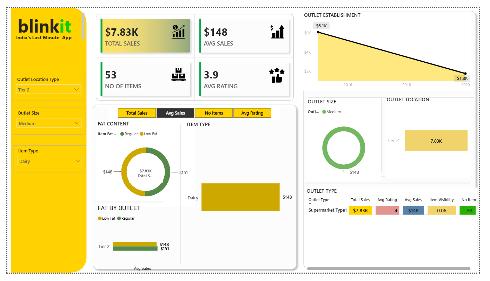

# 🛒 Blinkit Sales Analysis Dashboard | Power BI

## 📊 Project Overview

This project presents an interactive **Blinkit Sales Analysis Dashboard** developed using **Microsoft Power BI**. The dashboard provides a visual analysis of sales performance across different product categories, outlet characteristics, locations, and fat-content segments.

The objective of this project is to transform raw Blinkit grocery sales data into meaningful visual insights that can support **business analysis and data-driven decision-making**.

---

## 🎯 Project Objectives

* Analyze overall sales performance.
* Understand sales distribution across different **item types**.
* Compare sales based on **fat content**.
* Analyze performance across different **outlet types and sizes**.
* Compare sales across different **outlet locations**.
* Analyze outlet establishment trends.
* Provide an interactive dashboard for exploring sales data.

---

## 🛠️ Tools & Technologies

* **Power BI** – Dashboard development and visualization
* **Power Query** – Data cleaning and transformation
* **DAX** – Measures and calculations
* **Microsoft Excel** – Dataset and data preparation

---

## 📌 Dashboard Features

The dashboard includes interactive visualizations for:

### 🔹 Key Performance Indicators

* Total Sales
* Average Sales
* Item-level performance
* Customer/Outlet-related metrics

### 🔹 Sales Analysis

* Sales by **Item Type**
* Sales by **Fat Content**
* Fat Content by **Outlet**
* Sales by **Outlet Type**
* Sales by **Outlet Size**
* Sales by **Outlet Location**
* Sales by **Outlet Establishment Year**

### 🔹 Interactive Filters

Slicers are included to allow users to dynamically filter the dashboard and analyze specific segments of the data.

---

## 📈 Dashboard Preview

### Main Dashboard



### Sales Analysis by Item


### Sales Analysis by Outlet


---

## 🔄 Data Preparation Process

The project followed a typical data analytics workflow:

```text
Raw Dataset
     ↓
Data Cleaning
     ↓
Data Transformation
     ↓
Data Modeling
     ↓
DAX Calculations
     ↓
Data Visualization
     ↓
Interactive Power BI Dashboard
```

Data preparation and transformation were performed using **Power Query**, followed by analytical calculations using **DAX**.

---

## 📊 Analysis Performed

### Item Type Analysis

Analyzed sales distribution across different grocery product categories to understand which item types contribute to overall sales.

### Fat Content Analysis

Compared sales based on different fat-content categories and examined their distribution across outlets.

### Outlet Analysis

Analyzed sales performance across different outlet types, sizes, and locations.

### Outlet Establishment Analysis

Examined sales patterns based on the year in which outlets were established.

---

## 📁 Repository Contents

```text
Blinkit-Sales-Analysis-PowerBI/
│
├── README.md
│
├── Blinkit_Sales_Analysis.pbix
│
├── BlinkIT Grocery Data.xlsx
│
└── Screenshots/
    ├── Dashboard_Overview.png
    ├── Sales_Analysis_by_Item.png
    └── Sales_Analysis_by_Outlet.png
```

### Files Description

| File                          | Description                       |
| ----------------------------- | --------------------------------- |
| `Blinkit_Sales_Analysis.pbix` | Power BI dashboard and data model |
| `BlinkIT Grocery Data.xlsx`   | Dataset used for the analysis     |
| `Screenshots/`                | Dashboard screenshots             |
| `README.md`                   | Project documentation             |

---

## 🚀 How to Use

1. Download the `Blinkit_Sales_Analysis.pbix` file.
2. Open it using **Microsoft Power BI Desktop**.
3. If required, update the dataset/file path in Power Query.
4. Refresh the data.
5. Use the available slicers and interactive visuals to explore the dashboard.

---

## 💡 Skills Demonstrated

**Data Cleaning • Data Transformation • Data Analysis • Data Visualization • Power BI • Power Query • DAX • Business Intelligence • Dashboard Development**

---

## 👨‍💻 Author

**Kishor Khandagle**

Computer Engineering Graduate | Data Analytics Enthusiast

**Skills:** SQL | Python | Power BI | Excel | Data Analysis | Machine Learning

---

⭐ If you find this project useful, feel free to explore the repository and the Power BI dashboard.
